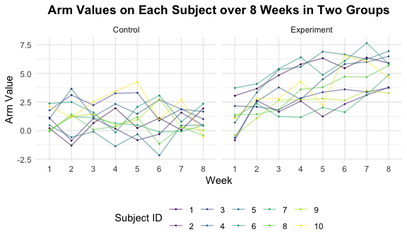

p8105\_hw5\_sl4836
================
Hun
11/13/2021

``` r
library(tidyverse)

knitr::opts_chunk$set(
  fig.width = 6,
  fig.asp = .6,
  out.width = "90%"
)

theme_set(theme_minimal() + theme(legend.position = "bottom"))

options(
  ggplot2.continuous.colour = "viridis",
  ggplot2.continuous.fill = "viridis"
)

scale_colour_discrete = scale_colour_viridis_d
scale_fill_discrete = scale_fill_viridis_d
```

### Problem\_0 - Creating Local Data File

``` r
dir.create(file.path(getwd(), "hw5_data_file"), recursive = TRUE)
```

    ## Warning in dir.create(file.path(getwd(), "hw5_data_file"), recursive = TRUE): '/
    ## Users/iseonghun/Desktop/columbia data science/p8105_hw5_sl4836/hw5_data_file'
    ## already exists

``` r
list.files()
```

    ## [1] "hw5_data_file"          "p8105_hw5_sl4836_files" "p8105_hw5_sl4836.md"   
    ## [4] "p8105_hw5_sl4836.Rmd"   "p8105_hw5_sl4836.Rproj" "README.md"

### Problem 1

``` r
urlfile = "https://raw.githubusercontent.com/washingtonpost/data-homicides/master/homicide-data.csv"

homicide_data <- read_csv(url(urlfile))
```

    ## Rows: 52179 Columns: 12

    ## ── Column specification ────────────────────────────────────────────────────────
    ## Delimiter: ","
    ## chr (9): uid, victim_last, victim_first, victim_race, victim_age, victim_sex...
    ## dbl (3): reported_date, lat, lon

    ## 
    ## ℹ Use `spec()` to retrieve the full column specification for this data.
    ## ℹ Specify the column types or set `show_col_types = FALSE` to quiet this message.

``` r
homicide_nrow <- nrow(homicide_data)
homicide_ncol <- ncol(homicide_data)
homicide_variables <- names(homicide_data)
```

The dimension of the homicide\_data is **52179 x** **12.** There are
**52179** number of observations of homicide cases in the 50 large U.S.
cities and **12** variables: *uid, reported\_date, victim\_last,
victim\_first, victim\_race, victim\_age, victim\_sex, city, state, lat,
lon, disposition.*

``` r
homicide_clean_data <-
  homicide_data %>%
  mutate(city_state = str_c(city, state),
         resolution = case_when(
          disposition == "Closed without arrest" ~ "unsolved",
         disposition == "Open/No arrest" ~ "unsolved",
         disposition == "Closed by arrest" ~ "solved"
         ))  %>%
  relocate(city_state) %>%
  filter(city_state != "TulsaAL")
```

``` r
baltimore_df <-  
  homicide_clean_data %>%
  filter(city_state == "BaltimoreMD")

baltimore_summary <-
  baltimore_df %>% 
  summarise(
    unsolved = sum(resolution == "unsolved"),
    n = n()
  )

baltimore_test <-
  prop.test(
  x = baltimore_summary %>% pull(unsolved),
  n = baltimore_summary %>% pull(n)
  )

baltimore_test %>% 
  broom::tidy()
```

    ## # A tibble: 1 × 8
    ##   estimate statistic  p.value parameter conf.low conf.high method    alternative
    ##      <dbl>     <dbl>    <dbl>     <int>    <dbl>     <dbl> <chr>     <chr>      
    ## 1    0.646      239. 6.46e-54         1    0.628     0.663 1-sample… two.sided

``` r
prop_test_fucntion <- function(city_df) {
  
  city_summary =
  city_df %>% 
  summarise(
    unsolved = sum(resolution == "unsolved"),
    n = n()
  )
  
  city_test =
  prop.test(
  x = city_summary %>% pull(unsolved),
  n = city_summary %>% pull(n)
  )
  
  
  return(city_test)
}
```

``` r
nested_df <-
  homicide_clean_data %>% 
  nest(data = uid:resolution) %>%
  mutate(
    test_results = map(data, prop_test_fucntion),
    tidy_results = map(test_results, broom::tidy)
  ) %>%
  select(city_state, tidy_results) %>%
  unnest(tidy_results) %>%
  select(city_state, estimate, starts_with("conf"))
```

``` r
nested_df
```

    ## # A tibble: 50 × 4
    ##    city_state    estimate conf.low conf.high
    ##    <chr>            <dbl>    <dbl>     <dbl>
    ##  1 AlbuquerqueNM    0.386    0.337     0.438
    ##  2 AtlantaGA        0.383    0.353     0.415
    ##  3 BaltimoreMD      0.646    0.628     0.663
    ##  4 Baton RougeLA    0.462    0.414     0.511
    ##  5 BirminghamAL     0.434    0.399     0.469
    ##  6 BostonMA         0.505    0.465     0.545
    ##  7 BuffaloNY        0.612    0.569     0.654
    ##  8 CharlotteNC      0.300    0.266     0.336
    ##  9 ChicagoIL        0.736    0.724     0.747
    ## 10 CincinnatiOH     0.445    0.408     0.483
    ## # … with 40 more rows

``` r
nested_df %>% 
  mutate(city_state = fct_reorder(city_state, estimate)) %>%
  ggplot(aes(x = city_state, y = estimate)) +
  geom_point() +
  geom_errorbar(aes(ymin = conf.low, ymax = conf.high)) +
  theme(axis.text.x = element_text(angle = 90, vjust = 0.5, hjust=1))
```


### Problem 2 - Importing Data

``` r
data_files <- 
  tibble(list.files("./hw5_data_file")) %>%
  mutate(file_list = paste(list.files("./hw5_data_file")))
```

### Problem 2 - Creating functions to read multiple datasets in the list

``` r
read_files <- function(x) {
  
    data = read_csv(paste0("./hw5_data_file/", x)) %>%
      mutate(file_names = x)
}

arm_dataset <- map_df(data_files$file_list, read_files)

arm_dataset
```

    ## # A tibble: 20 × 9
    ##    week_1 week_2 week_3 week_4 week_5 week_6 week_7 week_8 file_names
    ##     <dbl>  <dbl>  <dbl>  <dbl>  <dbl>  <dbl>  <dbl>  <dbl> <chr>     
    ##  1   0.2   -1.31   0.66   1.96   0.23   1.09   0.05   1.94 con_01.csv
    ##  2   1.13  -0.88   1.07   0.17  -0.83  -0.31   1.58   0.44 con_02.csv
    ##  3   1.77   3.11   2.22   3.26   3.31   0.89   1.88   1.01 con_03.csv
    ##  4   1.04   3.66   1.22   2.33   1.47   2.7    1.87   1.66 con_04.csv
    ##  5   0.47  -0.58  -0.09  -1.37  -0.32  -2.17   0.45   0.48 con_05.csv
    ##  6   2.37   2.5    1.59  -0.16   2.08   3.07   0.78   2.35 con_06.csv
    ##  7   0.03   1.21   1.13   0.64   0.49  -0.12  -0.07   0.46 con_07.csv
    ##  8  -0.08   1.42   0.09   0.36   1.18  -1.16   0.33  -0.44 con_08.csv
    ##  9   0.08   1.24   1.44   0.41   0.95   2.75   0.3    0.03 con_09.csv
    ## 10   2.14   1.15   2.52   3.44   4.26   0.97   2.73  -0.53 con_10.csv
    ## 11   3.05   3.67   4.84   5.8    6.33   5.46   6.38   5.91 exp_01.csv
    ## 12  -0.84   2.63   1.64   2.58   1.24   2.32   3.11   3.78 exp_02.csv
    ## 13   2.15   2.08   1.82   2.84   3.36   3.61   3.37   3.74 exp_03.csv
    ## 14  -0.62   2.54   3.78   2.73   4.49   5.82   6      6.49 exp_04.csv
    ## 15   0.7    3.33   5.34   5.57   6.9    6.66   6.24   6.95 exp_05.csv
    ## 16   3.73   4.08   5.4    6.41   4.87   6.09   7.66   5.83 exp_06.csv
    ## 17   1.18   2.35   1.23   1.17   2.02   1.61   3.13   4.88 exp_07.csv
    ## 18   1.37   1.43   1.84   3.6    3.8    4.72   4.68   5.7  exp_08.csv
    ## 19  -0.4    1.08   2.66   2.7    2.8    2.64   3.51   3.27 exp_09.csv
    ## 20   1.09   2.8    2.8    4.3    2.25   6.57   6.09   4.64 exp_10.csv

### Problem 2 - Tidying and wrangling the dataset

``` r
clean_arm_dataset <-
  arm_dataset %>%
  janitor::clean_names() %>%
  gather(key = week, value = arm_value, week_1:week_8) %>%
  mutate(week = str_remove(week, "week_")) %>%
  mutate(subject_ID = as.integer(str_extract(file_names, "[0-9][0-9]"))) %>%
  mutate(file_names = ifelse(str_detect(file_names, "con") == TRUE,
                             "Control", "Experiment")) %>%
  mutate(across(.cols = c(file_names, week, subject_ID), as.factor)) %>%
  relocate(file_names, subject_ID, arm_value)

clean_arm_dataset
```

    ## # A tibble: 160 × 4
    ##    file_names subject_ID arm_value week 
    ##    <fct>      <fct>          <dbl> <fct>
    ##  1 Control    1               0.2  1    
    ##  2 Control    2               1.13 1    
    ##  3 Control    3               1.77 1    
    ##  4 Control    4               1.04 1    
    ##  5 Control    5               0.47 1    
    ##  6 Control    6               2.37 1    
    ##  7 Control    7               0.03 1    
    ##  8 Control    8              -0.08 1    
    ##  9 Control    9               0.08 1    
    ## 10 Control    10              2.14 1    
    ## # … with 150 more rows

### Problem 2 - Making a spaghetti plot showing observations on each subject over time

``` r
clean_arm_dataset %>%
  ggplot(aes(week, arm_value, color=subject_ID)) + 
  geom_point(size = 0.2) + 
  geom_line(aes(group = subject_ID), alpha=0.5) +
  facet_grid(~file_names) +
  labs(x = "Week", y = "Arm Value", 
       title = "Arm Values on Each Subject over 8 Weeks in Two Groups",
       col = "Subject ID") +
  theme(plot.title = element_text(hjust = 0.5, face = "bold"))
```



In the experiment group, the arm values of subjects by and large show an
upward trend over time during 8 weeks though the time for and magnitude
of changes are different within subjects. On the other hand, in the
control group, the arm values of subjects in overall fluctuate over time
without any certain trends or patterns and by and large there is no huge
changes in arm values within subjects compared to subjects in the
experiment group. Another interesting observation is none of the
subjects in the control group reach arm value beyond 5 whereas about
half the subjects in the experiment group reach arm value beyond 5 over
time.

### Problem 3 - Importing data with missing vlaues

``` r
library(tidyverse)

set.seed(10)

iris_with_missing = iris %>% 
  map_df(~replace(.x, sample(1:150, 20), NA)) %>%
  mutate(Species = as.character(Species))
```

### Problem 3 - creating a function to fill in missing vlaues

``` r
fill_na <- function(v) {
  
  if (is.numeric(v)) {
    v = replace_na(v, mean(v, na.rm = T))
  }
  else if(is.character(v)) {
    v = replace_na(v, "virginica")
  }
  return(as.vector(v))
}

result <- 
  map(.x = iris_with_missing, ~fill_na(.x))

result
```

    ## $Sepal.Length
    ##   [1] 5.100000 4.900000 4.700000 4.600000 5.000000 5.400000 5.819231 5.000000
    ##   [9] 4.400000 4.900000 5.400000 4.800000 5.819231 4.300000 5.819231 5.700000
    ##  [17] 5.400000 5.100000 5.700000 5.100000 5.400000 5.100000 4.600000 5.819231
    ##  [25] 4.800000 5.000000 5.000000 5.200000 5.819231 4.700000 4.800000 5.400000
    ##  [33] 5.200000 5.500000 4.900000 5.000000 5.500000 4.900000 4.400000 5.100000
    ##  [41] 5.000000 4.500000 4.400000 5.000000 5.100000 4.800000 5.100000 4.600000
    ##  [49] 5.300000 5.000000 7.000000 6.400000 6.900000 5.500000 6.500000 5.700000
    ##  [57] 6.300000 4.900000 6.600000 5.200000 5.000000 5.900000 6.000000 6.100000
    ##  [65] 5.600000 6.700000 5.600000 5.800000 6.200000 5.600000 5.900000 5.819231
    ##  [73] 6.300000 5.819231 6.400000 6.600000 6.800000 6.700000 6.000000 5.700000
    ##  [81] 5.500000 5.819231 5.800000 6.000000 5.400000 5.819231 6.700000 5.819231
    ##  [89] 5.600000 5.500000 5.500000 5.819231 5.800000 5.000000 5.819231 5.700000
    ##  [97] 5.700000 6.200000 5.100000 5.700000 6.300000 5.800000 7.100000 6.300000
    ## [105] 6.500000 7.600000 4.900000 7.300000 6.700000 5.819231 6.500000 5.819231
    ## [113] 6.800000 5.700000 5.800000 6.400000 6.500000 7.700000 7.700000 6.000000
    ## [121] 5.819231 5.600000 7.700000 6.300000 6.700000 7.200000 6.200000 6.100000
    ## [129] 6.400000 7.200000 7.400000 7.900000 6.400000 5.819231 6.100000 5.819231
    ## [137] 5.819231 6.400000 6.000000 6.900000 6.700000 6.900000 5.819231 6.800000
    ## [145] 6.700000 6.700000 6.300000 6.500000 5.819231 5.900000
    ## 
    ## $Sepal.Width
    ##   [1] 3.500000 3.000000 3.200000 3.100000 3.600000 3.900000 3.400000 3.400000
    ##   [9] 2.900000 3.100000 3.075385 3.400000 3.075385 3.000000 4.000000 4.400000
    ##  [17] 3.900000 3.500000 3.800000 3.800000 3.400000 3.700000 3.600000 3.300000
    ##  [25] 3.400000 3.000000 3.400000 3.500000 3.400000 3.200000 3.100000 3.075385
    ##  [33] 3.075385 4.200000 3.100000 3.200000 3.500000 3.600000 3.000000 3.400000
    ##  [41] 3.500000 3.075385 3.200000 3.500000 3.800000 3.000000 3.800000 3.200000
    ##  [49] 3.700000 3.075385 3.075385 3.200000 3.100000 2.300000 2.800000 2.800000
    ##  [57] 3.300000 2.400000 2.900000 2.700000 2.000000 3.000000 2.200000 2.900000
    ##  [65] 2.900000 3.100000 3.000000 3.075385 2.200000 2.500000 3.200000 2.800000
    ##  [73] 2.500000 2.800000 2.900000 3.000000 2.800000 3.075385 3.075385 2.600000
    ##  [81] 2.400000 2.400000 2.700000 2.700000 3.000000 3.400000 3.100000 3.075385
    ##  [89] 3.000000 2.500000 3.075385 3.075385 3.075385 2.300000 2.700000 3.000000
    ##  [97] 2.900000 2.900000 2.500000 2.800000 3.075385 2.700000 3.000000 2.900000
    ## [105] 3.075385 3.000000 2.500000 2.900000 3.075385 3.600000 3.200000 2.700000
    ## [113] 3.000000 3.075385 2.800000 3.200000 3.000000 3.800000 2.600000 2.200000
    ## [121] 3.200000 3.075385 2.800000 2.700000 3.300000 3.200000 2.800000 3.000000
    ## [129] 2.800000 3.000000 2.800000 3.800000 2.800000 2.800000 3.075385 3.000000
    ## [137] 3.400000 3.100000 3.000000 3.100000 3.100000 3.100000 2.700000 3.200000
    ## [145] 3.300000 3.000000 2.500000 3.000000 3.400000 3.000000
    ## 
    ## $Petal.Length
    ##   [1] 1.400000 1.400000 1.300000 1.500000 1.400000 1.700000 1.400000 1.500000
    ##   [9] 1.400000 3.765385 1.500000 1.600000 1.400000 3.765385 3.765385 1.500000
    ##  [17] 1.300000 1.400000 1.700000 1.500000 1.700000 1.500000 1.000000 3.765385
    ##  [25] 1.900000 3.765385 1.600000 1.500000 1.400000 1.600000 3.765385 1.500000
    ##  [33] 1.500000 1.400000 3.765385 1.200000 1.300000 1.400000 1.300000 1.500000
    ##  [41] 1.300000 1.300000 1.300000 1.600000 1.900000 1.400000 1.600000 3.765385
    ##  [49] 1.500000 1.400000 4.700000 4.500000 4.900000 4.000000 4.600000 4.500000
    ##  [57] 4.700000 3.765385 4.600000 3.900000 3.765385 4.200000 4.000000 4.700000
    ##  [65] 3.600000 4.400000 4.500000 4.100000 4.500000 3.900000 4.800000 4.000000
    ##  [73] 4.900000 3.765385 4.300000 4.400000 4.800000 5.000000 4.500000 3.500000
    ##  [81] 3.800000 3.700000 3.900000 5.100000 4.500000 4.500000 4.700000 4.400000
    ##  [89] 3.765385 4.000000 4.400000 4.600000 4.000000 3.300000 4.200000 4.200000
    ##  [97] 4.200000 4.300000 3.000000 4.100000 3.765385 5.100000 5.900000 5.600000
    ## [105] 5.800000 6.600000 4.500000 6.300000 3.765385 3.765385 5.100000 5.300000
    ## [113] 5.500000 5.000000 5.100000 5.300000 3.765385 6.700000 6.900000 5.000000
    ## [121] 5.700000 4.900000 6.700000 4.900000 5.700000 6.000000 4.800000 4.900000
    ## [129] 5.600000 5.800000 6.100000 3.765385 3.765385 5.100000 5.600000 6.100000
    ## [137] 5.600000 5.500000 4.800000 5.400000 5.600000 5.100000 5.100000 3.765385
    ## [145] 3.765385 5.200000 5.000000 5.200000 5.400000 5.100000
    ## 
    ## $Petal.Width
    ##   [1] 0.200000 0.200000 0.200000 1.192308 0.200000 0.400000 0.300000 0.200000
    ##   [9] 0.200000 0.100000 0.200000 0.200000 0.100000 0.100000 0.200000 0.400000
    ##  [17] 0.400000 1.192308 0.300000 1.192308 0.200000 0.400000 0.200000 0.500000
    ##  [25] 0.200000 0.200000 0.400000 0.200000 0.200000 0.200000 0.200000 0.400000
    ##  [33] 0.100000 0.200000 0.200000 0.200000 0.200000 0.100000 1.192308 0.200000
    ##  [41] 0.300000 1.192308 0.200000 0.600000 0.400000 0.300000 0.200000 0.200000
    ##  [49] 0.200000 0.200000 1.400000 1.500000 1.500000 1.300000 1.500000 1.300000
    ##  [57] 1.600000 1.000000 1.300000 1.400000 1.000000 1.500000 1.192308 1.400000
    ##  [65] 1.300000 1.400000 1.500000 1.000000 1.500000 1.100000 1.800000 1.300000
    ##  [73] 1.500000 1.200000 1.300000 1.400000 1.400000 1.192308 1.192308 1.000000
    ##  [81] 1.100000 1.000000 1.200000 1.600000 1.500000 1.600000 1.192308 1.300000
    ##  [89] 1.192308 1.192308 1.200000 1.192308 1.192308 1.192308 1.300000 1.200000
    ##  [97] 1.300000 1.300000 1.192308 1.300000 2.500000 1.900000 2.100000 1.800000
    ## [105] 2.200000 2.100000 1.700000 1.800000 1.800000 2.500000 2.000000 1.900000
    ## [113] 2.100000 2.000000 2.400000 2.300000 1.800000 1.192308 2.300000 1.500000
    ## [121] 1.192308 2.000000 2.000000 1.800000 2.100000 1.800000 1.800000 1.800000
    ## [129] 2.100000 1.600000 1.192308 2.000000 2.200000 1.500000 1.400000 2.300000
    ## [137] 1.192308 1.192308 1.800000 2.100000 2.400000 2.300000 1.900000 2.300000
    ## [145] 2.500000 2.300000 1.900000 2.000000 2.300000 1.800000
    ## 
    ## $Species
    ##   [1] "setosa"     "setosa"     "setosa"     "setosa"     "setosa"    
    ##   [6] "setosa"     "setosa"     "setosa"     "setosa"     "setosa"    
    ##  [11] "setosa"     "setosa"     "setosa"     "setosa"     "setosa"    
    ##  [16] "setosa"     "setosa"     "setosa"     "setosa"     "setosa"    
    ##  [21] "setosa"     "virginica"  "setosa"     "setosa"     "virginica" 
    ##  [26] "setosa"     "virginica"  "setosa"     "setosa"     "setosa"    
    ##  [31] "setosa"     "setosa"     "setosa"     "setosa"     "setosa"    
    ##  [36] "setosa"     "setosa"     "setosa"     "setosa"     "setosa"    
    ##  [41] "setosa"     "virginica"  "setosa"     "setosa"     "setosa"    
    ##  [46] "virginica"  "setosa"     "setosa"     "setosa"     "setosa"    
    ##  [51] "virginica"  "versicolor" "versicolor" "versicolor" "versicolor"
    ##  [56] "versicolor" "virginica"  "versicolor" "virginica"  "versicolor"
    ##  [61] "versicolor" "versicolor" "versicolor" "versicolor" "versicolor"
    ##  [66] "versicolor" "versicolor" "versicolor" "versicolor" "versicolor"
    ##  [71] "versicolor" "virginica"  "versicolor" "versicolor" "versicolor"
    ##  [76] "versicolor" "versicolor" "versicolor" "versicolor" "virginica" 
    ##  [81] "versicolor" "versicolor" "versicolor" "versicolor" "versicolor"
    ##  [86] "versicolor" "versicolor" "versicolor" "versicolor" "versicolor"
    ##  [91] "versicolor" "versicolor" "versicolor" "virginica"  "versicolor"
    ##  [96] "versicolor" "versicolor" "versicolor" "versicolor" "virginica" 
    ## [101] "virginica"  "virginica"  "virginica"  "virginica"  "virginica" 
    ## [106] "virginica"  "virginica"  "virginica"  "virginica"  "virginica" 
    ## [111] "virginica"  "virginica"  "virginica"  "virginica"  "virginica" 
    ## [116] "virginica"  "virginica"  "virginica"  "virginica"  "virginica" 
    ## [121] "virginica"  "virginica"  "virginica"  "virginica"  "virginica" 
    ## [126] "virginica"  "virginica"  "virginica"  "virginica"  "virginica" 
    ## [131] "virginica"  "virginica"  "virginica"  "virginica"  "virginica" 
    ## [136] "virginica"  "virginica"  "virginica"  "virginica"  "virginica" 
    ## [141] "virginica"  "virginica"  "virginica"  "virginica"  "virginica" 
    ## [146] "virginica"  "virginica"  "virginica"  "virginica"  "virginica"

``` r
map(.x = result, ~is.vector(.x))
```

    ## $Sepal.Length
    ## [1] TRUE
    ## 
    ## $Sepal.Width
    ## [1] TRUE
    ## 
    ## $Petal.Length
    ## [1] TRUE
    ## 
    ## $Petal.Width
    ## [1] TRUE
    ## 
    ## $Species
    ## [1] TRUE

``` r
result_as_data_frame <- 
  map_df(.x = iris_with_missing, ~fill_na(.x))

result_as_data_frame
```

    ## # A tibble: 150 × 5
    ##    Sepal.Length Sepal.Width Petal.Length Petal.Width Species
    ##           <dbl>       <dbl>        <dbl>       <dbl> <chr>  
    ##  1         5.1          3.5         1.4         0.2  setosa 
    ##  2         4.9          3           1.4         0.2  setosa 
    ##  3         4.7          3.2         1.3         0.2  setosa 
    ##  4         4.6          3.1         1.5         1.19 setosa 
    ##  5         5            3.6         1.4         0.2  setosa 
    ##  6         5.4          3.9         1.7         0.4  setosa 
    ##  7         5.82         3.4         1.4         0.3  setosa 
    ##  8         5            3.4         1.5         0.2  setosa 
    ##  9         4.4          2.9         1.4         0.2  setosa 
    ## 10         4.9          3.1         3.77        0.1  setosa 
    ## # … with 140 more rows
