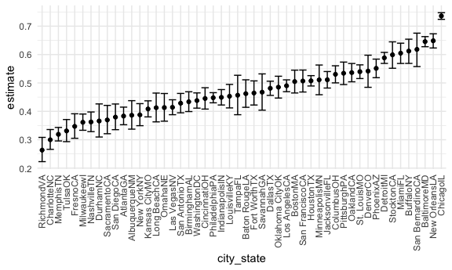

p8105\_hw5\_sl4836
================
Hun
11/13/2021

``` r
library(tidyverse)

knitr::opts_chunk$set(
  fig.width = 6,
  fig.asp = .6,
  out.width = "90%"
)

theme_set(theme_minimal() + theme(legend.position = "bottom"))

options(
  ggplot2.continuous.colour = "viridis",
  ggplot2.continuous.fill = "viridis"
)

scale_colour_discrete = scale_colour_viridis_d
scale_fill_discrete = scale_fill_viridis_d
```

### Problem\_0 - Creating Local Data File

``` r
dir.create(file.path(getwd(), "hw5_data_file"), recursive = TRUE)
```

    ## Warning in dir.create(file.path(getwd(), "hw5_data_file"), recursive = TRUE): '/
    ## Users/iseonghun/Downloads/p8105_hw5_sl4836/hw5_data_file' already exists

``` r
list.files()
```

    ## [1] "data"                   "hw5_data_file"          "p8105_hw5_sl4836_files"
    ## [4] "p8105_hw5_sl4836.md"    "p8105_hw5_sl4836.Rmd"   "p8105_hw5_sl4836.Rproj"
    ## [7] "README.md"

### Problem 1

``` r
urlfile = "https://raw.githubusercontent.com/washingtonpost/data-homicides/master/homicide-data.csv"

homicide_data <- read_csv(url(urlfile))
```

    ## Rows: 52179 Columns: 12

    ## ── Column specification ────────────────────────────────────────────────────────
    ## Delimiter: ","
    ## chr (9): uid, victim_last, victim_first, victim_race, victim_age, victim_sex...
    ## dbl (3): reported_date, lat, lon

    ## 
    ## ℹ Use `spec()` to retrieve the full column specification for this data.
    ## ℹ Specify the column types or set `show_col_types = FALSE` to quiet this message.

``` r
homicide_nrow <- nrow(homicide_data)
homicide_ncol <- ncol(homicide_data)
homicide_variables <- names(homicide_data)
```

The dimension of the homicide\_data is **52179 x** **12.** There are
**52179** number of observations of homicide cases in the 50 large U.S.
cities and **12** variables: *uid, reported\_date, victim\_last,
victim\_first, victim\_race, victim\_age, victim\_sex, city, state, lat,
lon, disposition.*

``` r
homicide_clean_data <-
  homicide_data %>%
  mutate(city_state = str_c(city, state),
         resolution = case_when(
          disposition == "Closed without arrest" ~ "unsolved",
         disposition == "Open/No arrest" ~ "unsolved",
         disposition == "Closed by arrest" ~ "solved"
         ))  %>%
  relocate(city_state) %>%
  filter(city_state != "TulsaAL")
```

``` r
baltimore_df <-  
  homicide_clean_data %>%
  filter(city_state == "BaltimoreMD")

baltimore_summary <-
  baltimore_df %>% 
  summarise(
    unsolved = sum(resolution == "unsolved"),
    n = n()
  )

baltimore_test <-
  prop.test(
  x = baltimore_summary %>% pull(unsolved),
  n = baltimore_summary %>% pull(n)
  )

baltimore_test %>% 
  broom::tidy()
```

    ## # A tibble: 1 × 8
    ##   estimate statistic  p.value parameter conf.low conf.high method    alternative
    ##      <dbl>     <dbl>    <dbl>     <int>    <dbl>     <dbl> <chr>     <chr>      
    ## 1    0.646      239. 6.46e-54         1    0.628     0.663 1-sample… two.sided

``` r
prop_test_fucntion <- function(city_df) {
  
  city_summary =
  city_df %>% 
  summarise(
    unsolved = sum(resolution == "unsolved"),
    n = n()
  )
  
  city_test =
  prop.test(
  x = city_summary %>% pull(unsolved),
  n = city_summary %>% pull(n)
  )
  
  
  return(city_test)
}
```

``` r
nested_df <-
  homicide_clean_data %>% 
  nest(data = uid:resolution) %>%
  mutate(
    test_results = map(data, prop_test_fucntion),
    tidy_results = map(test_results, broom::tidy)
  ) %>%
  select(city_state, tidy_results) %>%
  unnest(tidy_results) %>%
  select(city_state, estimate, starts_with("conf"))
```

``` r
nested_df
```

    ## # A tibble: 50 × 4
    ##    city_state    estimate conf.low conf.high
    ##    <chr>            <dbl>    <dbl>     <dbl>
    ##  1 AlbuquerqueNM    0.386    0.337     0.438
    ##  2 AtlantaGA        0.383    0.353     0.415
    ##  3 BaltimoreMD      0.646    0.628     0.663
    ##  4 Baton RougeLA    0.462    0.414     0.511
    ##  5 BirminghamAL     0.434    0.399     0.469
    ##  6 BostonMA         0.505    0.465     0.545
    ##  7 BuffaloNY        0.612    0.569     0.654
    ##  8 CharlotteNC      0.300    0.266     0.336
    ##  9 ChicagoIL        0.736    0.724     0.747
    ## 10 CincinnatiOH     0.445    0.408     0.483
    ## # … with 40 more rows

``` r
nested_df %>% 
  mutate(city_state = fct_reorder(city_state, estimate)) %>%
  ggplot(aes(x = city_state, y = estimate)) +
  geom_point() +
  geom_errorbar(aes(ymin = conf.low, ymax = conf.high)) +
  theme(axis.text.x = element_text(angle = 90, vjust = 0.5, hjust=1))
```



### Problem 2 - Importing Data

``` r
data_files <- 
  tibble(list.files("./data")) %>%
  mutate(file_list = paste(list.files("./data")))
```

### Problem 2 - Creating functions to read multiple datasets in the list

``` r
read_files <- function(x) {
  
    data = read_csv(paste0("./data/", x)) %>%
      mutate(file_names = x)
}

arm_dataset <- map_df(data_files$file_list, read_files) 
arm_dataset
```

    ## # A tibble: 20 × 9
    ##    week_1 week_2 week_3 week_4 week_5 week_6 week_7 week_8 file_names
    ##     <dbl>  <dbl>  <dbl>  <dbl>  <dbl>  <dbl>  <dbl>  <dbl> <chr>     
    ##  1   0.2   -1.31   0.66   1.96   0.23   1.09   0.05   1.94 con_01.csv
    ##  2   1.13  -0.88   1.07   0.17  -0.83  -0.31   1.58   0.44 con_02.csv
    ##  3   1.77   3.11   2.22   3.26   3.31   0.89   1.88   1.01 con_03.csv
    ##  4   1.04   3.66   1.22   2.33   1.47   2.7    1.87   1.66 con_04.csv
    ##  5   0.47  -0.58  -0.09  -1.37  -0.32  -2.17   0.45   0.48 con_05.csv
    ##  6   2.37   2.5    1.59  -0.16   2.08   3.07   0.78   2.35 con_06.csv
    ##  7   0.03   1.21   1.13   0.64   0.49  -0.12  -0.07   0.46 con_07.csv
    ##  8  -0.08   1.42   0.09   0.36   1.18  -1.16   0.33  -0.44 con_08.csv
    ##  9   0.08   1.24   1.44   0.41   0.95   2.75   0.3    0.03 con_09.csv
    ## 10   2.14   1.15   2.52   3.44   4.26   0.97   2.73  -0.53 con_10.csv
    ## 11   3.05   3.67   4.84   5.8    6.33   5.46   6.38   5.91 exp_01.csv
    ## 12  -0.84   2.63   1.64   2.58   1.24   2.32   3.11   3.78 exp_02.csv
    ## 13   2.15   2.08   1.82   2.84   3.36   3.61   3.37   3.74 exp_03.csv
    ## 14  -0.62   2.54   3.78   2.73   4.49   5.82   6      6.49 exp_04.csv
    ## 15   0.7    3.33   5.34   5.57   6.9    6.66   6.24   6.95 exp_05.csv
    ## 16   3.73   4.08   5.4    6.41   4.87   6.09   7.66   5.83 exp_06.csv
    ## 17   1.18   2.35   1.23   1.17   2.02   1.61   3.13   4.88 exp_07.csv
    ## 18   1.37   1.43   1.84   3.6    3.8    4.72   4.68   5.7  exp_08.csv
    ## 19  -0.4    1.08   2.66   2.7    2.8    2.64   3.51   3.27 exp_09.csv
    ## 20   1.09   2.8    2.8    4.3    2.25   6.57   6.09   4.64 exp_10.csv

### Problem 2 - Tidying and wrangling the dataset

``` r
clean_arm_dataset <-
  arm_dataset %>%
  janitor::clean_names() %>%
  gather(key = week, value = arm_value, week_1:week_8) %>%
  mutate(week = str_remove(week, "week_")) %>%
  mutate(id = as.integer(str_extract(file_names, "[0-9][0-9]"))) %>%
  mutate(file_names = ifelse(str_detect(file_names, "con") == TRUE,
                             "Control", "Experiment")) %>%
  mutate(across(.cols = c(file_names, week, id), as.factor)) %>%
  relocate(file_names, id, arm_value)

clean_arm_dataset
```

    ## # A tibble: 160 × 4
    ##    file_names id    arm_value week 
    ##    <fct>      <fct>     <dbl> <fct>
    ##  1 Control    1          0.2  1    
    ##  2 Control    2          1.13 1    
    ##  3 Control    3          1.77 1    
    ##  4 Control    4          1.04 1    
    ##  5 Control    5          0.47 1    
    ##  6 Control    6          2.37 1    
    ##  7 Control    7          0.03 1    
    ##  8 Control    8         -0.08 1    
    ##  9 Control    9          0.08 1    
    ## 10 Control    10         2.14 1    
    ## # … with 150 more rows

``` r
data_files <- 
  tibble(list.files("./data"))
```

``` r
data_path <- 
  data_files %>%
  mutate(file_list = paste(list.files("./data"))) %>%
  mutate(file_path = paste0("./data/", file_list)) %>%
  select(file_path)


data_path
```

    ## # A tibble: 20 × 1
    ##    file_path        
    ##    <chr>            
    ##  1 ./data/con_01.csv
    ##  2 ./data/con_02.csv
    ##  3 ./data/con_03.csv
    ##  4 ./data/con_04.csv
    ##  5 ./data/con_05.csv
    ##  6 ./data/con_06.csv
    ##  7 ./data/con_07.csv
    ##  8 ./data/con_08.csv
    ##  9 ./data/con_09.csv
    ## 10 ./data/con_10.csv
    ## 11 ./data/exp_01.csv
    ## 12 ./data/exp_02.csv
    ## 13 ./data/exp_03.csv
    ## 14 ./data/exp_04.csv
    ## 15 ./data/exp_05.csv
    ## 16 ./data/exp_06.csv
    ## 17 ./data/exp_07.csv
    ## 18 ./data/exp_08.csv
    ## 19 ./data/exp_09.csv
    ## 20 ./data/exp_10.csv

### Problem 2 - Making a spaghetti plot showing observations on each subject over time

``` r
clean_arm_dataset %>%
  ggplot(aes(week, arm_value, color=id)) + 
  geom_point(size = 0.2) + 
  geom_line(aes(group = id), alpha=0.5) +
  facet_grid(~file_names) +
  labs(x = "Week", y = "Arm Value", 
       title = "Arm Values on Each Subject over 8 Weeks in Two Groups")+
  theme(plot.title = element_text(hjust = 0.5, face = "bold"))
```


In the experiment group, the arm values of subjects by and large show an
upward trend over time during 8 weeks though the time for and magnitude
of changes are different within subjects. On the other hand, in the
control group, the arm values of subjects in overall fluctuate over time
without any certain trends or patterns and by and large there is no huge
changes in arm values within subjects compared to subjects in experiment
group.

``` r
library(tidyverse)

set.seed(10)

iris_with_missing = iris %>% 
  map_df(~replace(.x, sample(1:150, 20), NA)) %>%
  mutate(Species = as.character(Species))

iris_with_missing
```

    ## # A tibble: 150 × 5
    ##    Sepal.Length Sepal.Width Petal.Length Petal.Width Species
    ##           <dbl>       <dbl>        <dbl>       <dbl> <chr>  
    ##  1          5.1         3.5          1.4         0.2 setosa 
    ##  2          4.9         3            1.4         0.2 setosa 
    ##  3          4.7         3.2          1.3         0.2 setosa 
    ##  4          4.6         3.1          1.5        NA   setosa 
    ##  5          5           3.6          1.4         0.2 setosa 
    ##  6          5.4         3.9          1.7         0.4 setosa 
    ##  7         NA           3.4          1.4         0.3 setosa 
    ##  8          5           3.4          1.5         0.2 setosa 
    ##  9          4.4         2.9          1.4         0.2 setosa 
    ## 10          4.9         3.1         NA           0.1 setosa 
    ## # … with 140 more rows

### Problem 3

``` r
fill_NA <- function(v) {
  
  numeric_result = 
    v %>%  
    mutate_if(is.numeric, 
              funs(ifelse(is.na(.),  mean(., na.rm = TRUE), .))) %>%
    select_if(is.numeric)
                    
  character_result = 
    v %>% 
    mutate_if(is.character, replace_na, replace = "virginica") %>% 
    select_if(is.character)
  
  tibble(numeric_result, character_result)
}

fill_NA(iris_with_missing)
```

    ## Warning: `funs()` was deprecated in dplyr 0.8.0.
    ## Please use a list of either functions or lambdas: 
    ## 
    ##   # Simple named list: 
    ##   list(mean = mean, median = median)
    ## 
    ##   # Auto named with `tibble::lst()`: 
    ##   tibble::lst(mean, median)
    ## 
    ##   # Using lambdas
    ##   list(~ mean(., trim = .2), ~ median(., na.rm = TRUE))
    ## This warning is displayed once every 8 hours.
    ## Call `lifecycle::last_lifecycle_warnings()` to see where this warning was generated.

    ## # A tibble: 150 × 5
    ##    Sepal.Length Sepal.Width Petal.Length Petal.Width Species
    ##           <dbl>       <dbl>        <dbl>       <dbl> <chr>  
    ##  1         5.1          3.5         1.4         0.2  setosa 
    ##  2         4.9          3           1.4         0.2  setosa 
    ##  3         4.7          3.2         1.3         0.2  setosa 
    ##  4         4.6          3.1         1.5         1.19 setosa 
    ##  5         5            3.6         1.4         0.2  setosa 
    ##  6         5.4          3.9         1.7         0.4  setosa 
    ##  7         5.82         3.4         1.4         0.3  setosa 
    ##  8         5            3.4         1.5         0.2  setosa 
    ##  9         4.4          2.9         1.4         0.2  setosa 
    ## 10         4.9          3.1         3.77        0.1  setosa 
    ## # … with 140 more rows

``` r
read_files <- function(x) {
  
    data = read.csv(x)
}

map_df(data_path$file_path, read_files)
```

    ##    week_1 week_2 week_3 week_4 week_5 week_6 week_7 week_8
    ## 1    0.20  -1.31   0.66   1.96   0.23   1.09   0.05   1.94
    ## 2    1.13  -0.88   1.07   0.17  -0.83  -0.31   1.58   0.44
    ## 3    1.77   3.11   2.22   3.26   3.31   0.89   1.88   1.01
    ## 4    1.04   3.66   1.22   2.33   1.47   2.70   1.87   1.66
    ## 5    0.47  -0.58  -0.09  -1.37  -0.32  -2.17   0.45   0.48
    ## 6    2.37   2.50   1.59  -0.16   2.08   3.07   0.78   2.35
    ## 7    0.03   1.21   1.13   0.64   0.49  -0.12  -0.07   0.46
    ## 8   -0.08   1.42   0.09   0.36   1.18  -1.16   0.33  -0.44
    ## 9    0.08   1.24   1.44   0.41   0.95   2.75   0.30   0.03
    ## 10   2.14   1.15   2.52   3.44   4.26   0.97   2.73  -0.53
    ## 11   3.05   3.67   4.84   5.80   6.33   5.46   6.38   5.91
    ## 12  -0.84   2.63   1.64   2.58   1.24   2.32   3.11   3.78
    ## 13   2.15   2.08   1.82   2.84   3.36   3.61   3.37   3.74
    ## 14  -0.62   2.54   3.78   2.73   4.49   5.82   6.00   6.49
    ## 15   0.70   3.33   5.34   5.57   6.90   6.66   6.24   6.95
    ## 16   3.73   4.08   5.40   6.41   4.87   6.09   7.66   5.83
    ## 17   1.18   2.35   1.23   1.17   2.02   1.61   3.13   4.88
    ## 18   1.37   1.43   1.84   3.60   3.80   4.72   4.68   5.70
    ## 19  -0.40   1.08   2.66   2.70   2.80   2.64   3.51   3.27
    ## 20   1.09   2.80   2.80   4.30   2.25   6.57   6.09   4.64
